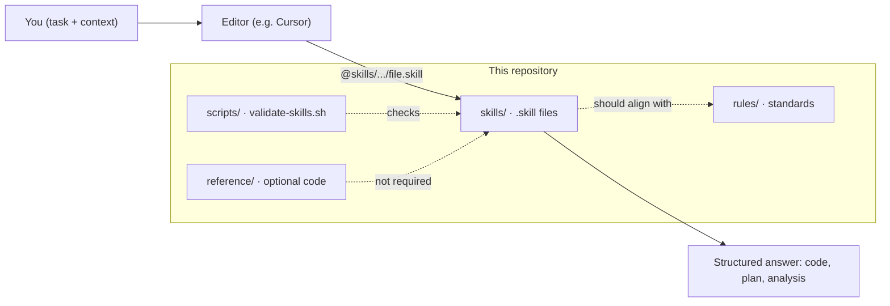
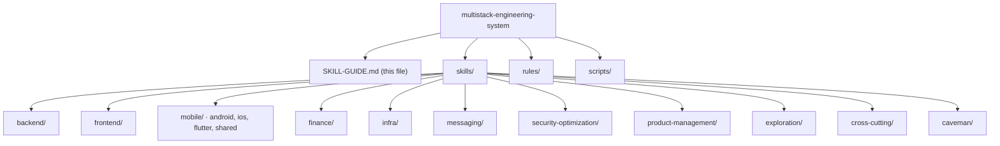
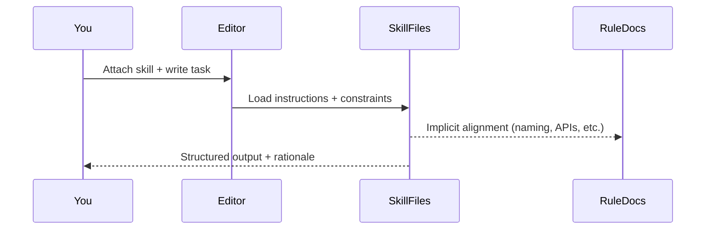
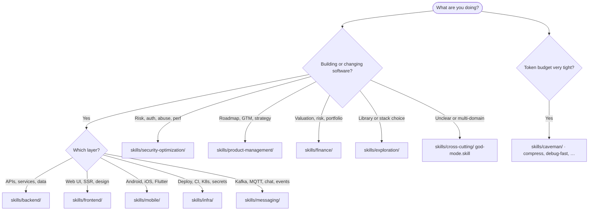
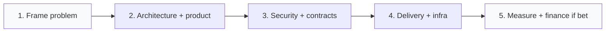

# Skill Guide

Primary entry for **multistack-engineering-system**. Read [README.md](README.md) for repository purpose, installation, and maintainer details. This file explains **how skills work**, **how to pick them**, and gives **copy-paste prompts**.

---

## What this repository is (in one picture)



- **`skills/`** — domain expertise as `.skill` files (attach with `@` in Cursor-style tools).
- **`rules/`** — engineering standards; use alongside skills for consistent naming, APIs, logging, etc.
- **`reference/`** — optional sample implementations; **not** part of the skill contract.

---

## Repository layout (skills tree)



---

## How a single skill is used



`SkillFiles` means the attached `.skill` file under `skills/`; `RuleDocs` means standards in `rules/` that outputs should respect.

**Minimum pattern:** one `@` reference to a `.skill` file, plus a short task with desired **output shape** (e.g. “return bullet list”, “YAML only”, “table + risks”).

---

## Pick a skill (routing)



**Fast lookup:**

| You hear… | Open under |
|-----------|------------|
| tenant, isolation, gateway | `backend/` + often `cross-cutting/api-contract-design` |
| Next/Nuxt, React Query, a11y | `frontend/` |
| Hilt, Navigation, SwiftUI | `mobile/` |
| Dockerfile, HPA, migrate | `infra/` |
| Kafka vs MQTT, DLQ | `messaging/` |
| OWASP, JWT hardening | `security-optimization/` |
| SWOT, MVP, unit economics | `product-management/` |
| DCF, VaR, statements | `finance/` |

---

## Skill contract (what every `.skill` aims to provide)

1. Purpose · 2. When to use · 3. Input format · 4. Output format · 5. Execution logic · 6. Rules · 7. Constraints · 8. Examples · 9. Output style  

Cross-cutting expectations: stepwise reasoning, explicit tradeoffs, risks when they change the answer.

Validate after edits:

```bash
./scripts/validate-skills.sh
```

---

## Copy-paste examples (sample prompts)

Paths assume the repo is on disk as `multistack-engineering-system/`; shorten to `@skills/...` if your workspace root is already this repo.

### Backend

**Multi-tenant API**

```text
@skills/backend/multi-tenant-saas.skill

Subdomain tenants, shared Postgres. Need resolution order, tenant context in requests, and data isolation strategy. Output: numbered plan + risks.
```

**API versioning**

```text
@skills/backend/api-versioning.skill

Public REST API; mobile clients lag 6+ months. Define deprecation window, version header strategy, and contract tests. Table + bullet risks.
```

**Distributed transactions**

```text
@skills/backend/distributed-transactions.skill

Checkout spans order, payment, shipment services. Design Saga: steps, compensation, idempotency keys, timeouts. YAML outline.
```

### Frontend

**Framework choice**

```text
@skills/frontend/frontend-framework-decision.skill

Marketing site + authenticated dashboard; SEO matters for marketing only. Compare Next vs Nuxt vs SPA; pick one with reasons and when to revisit.
```

**App Router + data**

```text
@skills/frontend/nextjs-scalable-architecture.skill

Next.js App Router: server vs client components for dashboard, caching boundaries, one performance pitfall to avoid. Short structured answer.
```

**Auth + API client**

```text
@skills/frontend/frontend-auth-flow.skill
@skills/frontend/frontend-api-layer.skill

Cookie session + refresh rotation; TanStack Query for server state. Middleware sketch + query key conventions. Code snippets OK.
```

### Mobile

**Android feature**

```text
@skills/mobile/android/android-clean-architecture.skill
@skills/mobile/android/android-hilt-setup.skill

New settings screen: ViewModel, repository, Hilt modules. List layers and one interface each.
```

**iOS navigation**

```text
@skills/mobile/ios/ios-navigation-flow.skill

SwiftUI: router + deep link into a detail screen. Pattern only; generic screen names.
```

### Infrastructure

**Containers + K8s**

```text
@skills/infra/docker-kubernetes.skill

Stateless Go API, port 8080, needs probes + HPA. Dockerfile + Deployment + Service outline; non-root user.
```

**CI/CD**

```text
@skills/infra/ci-cd-pipeline.skill

GitHub Actions: test → build image tagged with git SHA → deploy staging on main. List stages + one rollback step.
```

### Security & resilience

**API hardening**

```text
@skills/security-optimization/secure-api-design.skill

Public REST: authn/z, rate limits, input validation, safe errors. Checklist grouped by OWASP-style categories.
```

**Deployment**

```text
@skills/security-optimization/secure-deployment.skill

Rolling deploy to K8s: secrets, network policy mention, what to verify post-deploy. Concise.
```

### Messaging

**Events**

```text
@skills/messaging/kafka-system-design.skill

Order lifecycle events; multiple consumers; need ordering scope and retention. Topics + partition key strategy + failure modes.
```

**Devices / realtime**

```text
@skills/messaging/mqtt-realtime-architecture.skill

Mobile app, unreliable network, command/ack to devices. When MQTT vs WebSocket; session and QoS notes.
```

### Finance

**Valuation**

```text
@skills/finance/dcf-full-model.skill

Revenue 120M, 18% growth 5y then fade; WACC 11%; terminal growth 2.5%. Need explicit assumptions table + sensitivity on WACC. No stock advice.
```

**Risk**

```text
@skills/finance/risk-modeling.skill

Public equity sleeve: define beta usage, VaR intuition, and what VaR does not capture. Bullet format.
```

### Product management

**Go / no-go**

```text
@skills/product-management/product-feasibility.skill
@skills/product-management/unit-economics.skill

B2B workflow tool: build vs partner vs delay. Decision + 3 risks + rough unit economics levers. Executive tone.
```

### Cross-cutting & review

**Everything at once**

```text
@skills/cross-cutting/god-mode.skill

New billing workflow across web + API + ops. Unknown best architecture. One recommendation: product + technical + rollout risks. Caveman output.
```

**PR review**

```text
@skills/cross-cutting/review-like-senior-engineer.skill

Paste diff summary: focus security + correctness + test gaps. Severity labels P0–P2.
```

### Caveman (density / speed)

```text
@skills/caveman/debug-fast.skill

Error: intermittent 503 on POST /v1/orders under load. Hypothesis list + next 3 instrumentation steps. Ultra compact.
```

---

## Chaining (when one skill is not enough)



| Goal | Example chain |
|------|----------------|
| Tenant SaaS slice | `multi-tenant-saas` → `api-contract-design` → `secure-api-design` → `ci-cd-pipeline` |
| Event-driven feature | `kafka-system-design` or `mqtt-realtime-architecture` → `message-reliability` → backend/mobile push skills as needed |
| Board-style bet | `product-decision-engine` → `unit-economics` → `dcf-full-model` |

Rules: start with the skill that sets the **operating model**; add **security** before rollout; avoid duplicate skills that answer the same question.

---

## God mode

Use [`skills/cross-cutting/god-mode.skill`](skills/cross-cutting/god-mode.skill) when the ask is **mixed-domain** or **ambiguous**. It should: detect domains → pick a minimal chain → merge into **one** recommendation (often caveman-style if you ask).

---

## Caveman folder

Use `skills/caveman/` when you need **short, high-density** output (`debug-fast`, `compress-response`, etc.). Pair with domain skills when you still need depth—caveman as **format**, not a substitute for domain skills.

---

## Messaging, security, product, finance (short pointers)

- **Messaging:** Kafka for durable streams; MQTT for devices / thin clients; add `event-schema-design` + `message-reliability` when contracts and failure handling matter.
- **Security:** assume least privilege, validate inputs, safe errors, rate limits; use `secure-api-design` + `auth-security-hardening` for exposed APIs.
- **Product:** match framework to decision type (SWOT/PESTLE vs feasibility vs GTM); see tables in repository skills under `product-management/`.
- **Finance:** pair engineering or product bets with `unit-economics` or `dcf-full-model` when allocation or valuation is in scope.

---

## Operating rule

This repository is an **operating system**, not a prompt dump.

Use structured inputs, the **smallest** correct skill chain, and ask for a **clear output shape**. Force a recommendation when the problem allows it.
